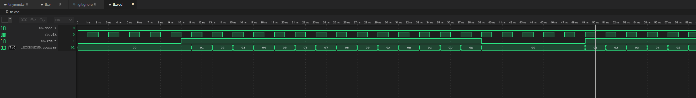

# Micromind Testbench

Extremely basic test.

# Usage

```
make           # Compile
make run       # Run Simulation
make gtkwave   # To view in gtkwave
```

# Example

As shown below, counter reaches limit, denotes it's completion, tb resets the module an runs it again.

*Figure 1*
